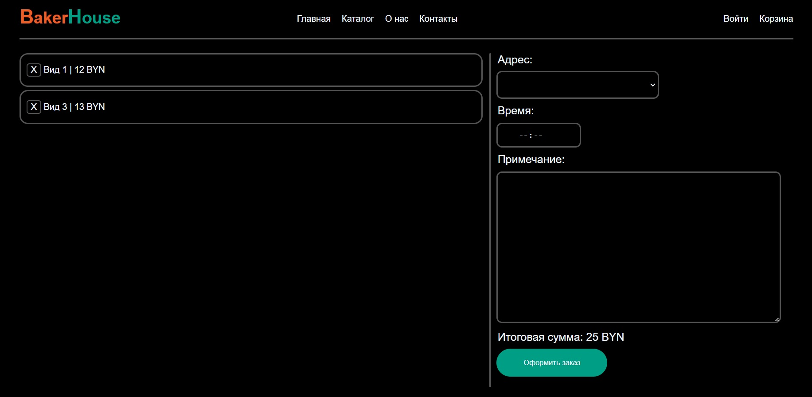

# Интернет-магазин выпечки
---

Готовый проект включает в себя магазин выпечки, реализованный без фрейморков.

Дизайн выполнен в редакторе Figma.
- Ссылка: https://www.figma.com/file/PEhhpsm9aFpLjEfvqm7x24/Site?node-id=2%3A12&t=vdrVgEGAULarBr44-1

---

**Главная страница**

**Страница товаров**

**Страница корзины**

---

**Функции, используемые в проекте:**

- Функция отображения всех товаров
- Функция добавления товара в корзину
- Функция удаления товара из корзины
- Функция отображения корзины
- Функция оформления заказа
---

**Модели данных:**

- Модель товара:
  - Изображение товара
  - Название товара
  - Описание товара
  - Цена товара
  
- Модель пользователя:
  - Логин
  - Пароль
  - Массив товаров

- Модель заказа: 
  - Пользователь
  - Место выдачи
  - Время выдачи
  - Примечание
---
